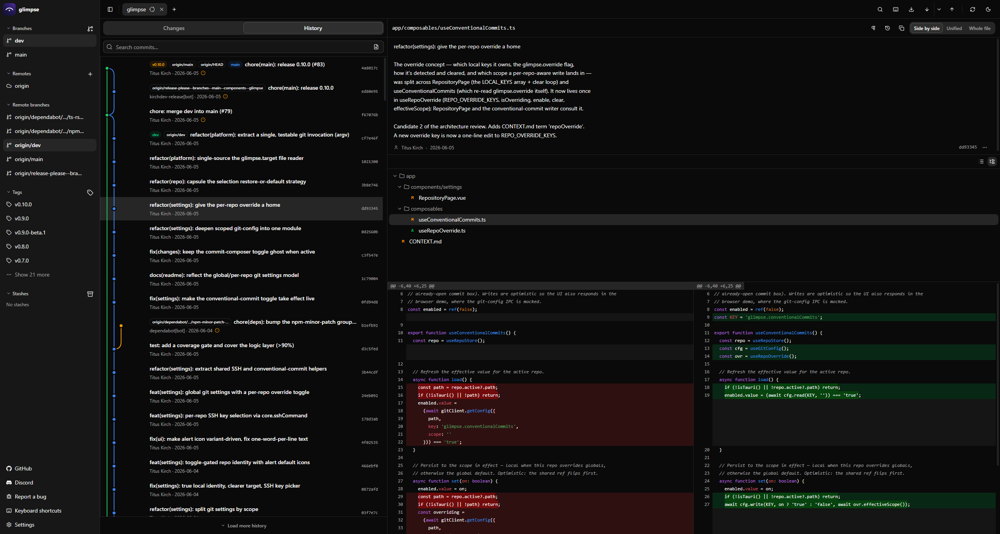

<div align="center">


# glimpse

**A lightweight, git-native desktop Git client — the full branch graph, diffs, and everyday git, with first-class WSL support**

[](https://github.com/TitusKirch/glimpse/releases/latest)
[](https://github.com/TitusKirch/glimpse/releases)
[](https://github.com/TitusKirch/glimpse/actions/workflows/ci.yml)
[](LICENSE)



</div>

---

```bash
# glimpse drives your real git, per repo — automatically:
git -C C:\dev\repo log --graph                               # a Windows-path repo → Windows git
wsl.exe -d Ubuntu --cd /home/you/repo --exec git log --graph # a \\wsl$ repo → that distro's git
```

That's it. A slim, fast desktop client that shells out to your own `git` — no reimplemented engine, no Chromium, and on Windows it transparently uses WSL git for repos that live in the WSL filesystem.

## ✨ Features

- **🪶 Featherweight** — built on [Tauri](https://tauri.app/), it uses the OS-native WebView (WebView2 / WebKitGTK) instead of bundling Chromium. Small disk and RAM footprint.
- **🧬 Git-native** — never reimplements git; it shells out to your real `git` binary and parses its porcelain output. Your config, hooks, and credentials apply unchanged, glimpse stores no secrets, signs commits and tags with your GPG/SSH key when configured, and Git LFS-tracked files are detected and surfaced.
- **🪟 First-class WSL (Windows)** — a `\\wsl$` repository is driven through that distro's git automatically, while Windows-path repos use Windows git. No setup; a per-repo override can still pin the git binary or WSL distro.
- **📂 Get a repo** — open a local folder, **clone** a remote, or **init** a brand-new repository.
- **🌳 Graph & history** — the full multi-branch commit graph, history search by message **or content** (pickaxe `-S`/`-G`), per-commit detail, GPG/SSH signature verification, and a repository-statistics panel (contributors, activity, file churn).
- **🔍 Rich diffs** — side-by-side, unified, or whole-file, with syntax highlighting, word-level diff, collapsible unchanged regions, soft word-wrap, **image diffs** (side-by-side / onion-skin), ignore-whitespace, blame, and file history.
- **✏️ Stage & commit** — stage/unstage by file, **hunk, or line**, discard, commit, amend (optionally signed, with an opt-in conventional-commit composer), and resolve conflicts whole-file or with a **region-by-region three-way merge editor**.
- **🗂️ Changelists & a headless CLI** — group pending changes into named sets (JetBrains-style) and commit one set at a time, with membership stored as a **git-native, human-readable JSON file**. The same binary answers from a terminal with no window open — every read view the GUI has (`status`, `diff`, `log`, `show`, `history`, `blame`, `branches`, `stashes`, `reflog`, `worktrees`, `submodules`, `sparse`, `stats`, `info`), the working-tree writes (`stage`, `unstage`, `discard`, `commit`, `amend`) and `glimpse cl …`, every one of them with `--json` and `-C <dir>` — so scripts, CI and AI agents drive the repository exactly as the app does.
- **🌿 Branches, tags & stashes** — create/switch/rename/delete branches, merge, cherry-pick, revert, reset (soft/mixed/hard), **annotated/signed tags**, and stash save/pop/apply/drop.
- **🛠️ Advanced git** — rebase (interactive or onto a ref), guided bisect, compare any two refs **or two selected commits**, reflog recovery with one-click undo, **export/apply patches**, plus worktrees, submodules, and sparse-checkout.
- **🔄 Live refresh** — a debounced filesystem watcher repaints status, diff, and graph as files change, with manual and on-window-focus refresh as fallback.
- **⌨️ Fast workflow** — command palette, **global fuzzy quick-open** (files / branches / commits), keyboard shortcuts, drag-reorderable multi-repo tabs, a resizable sidebar, recent repos, and "open in editor / terminal / file manager".
- **🌓 Themed & localized** — dark/light follows the OS (manually switchable), with a localized UI.

<details>
<summary>Full feature list</summary>

- **Repositories** — open a local folder, clone a remote, or initialise a new repository.
- **Viewing** — multi-branch commit graph, commit search by message or content (pickaxe `-S`/`-G`), side-by-side / unified / whole-file diffs with syntax highlighting, word-level diff, collapsible unchanged regions and soft word-wrap, image diffs (side-by-side / onion-skin), ignore-whitespace, blame, file history, list/tree file view, compare any two refs or two selected commits, repository statistics (contributors / activity / churn), GPG/SSH signature verification status, Git LFS-tracked files flagged.
- **Staging & commits** — stage / unstage by file, hunk, or line, discard by file or hunk, discard all, commit, `commit --amend`, optional GPG/SSH commit signing, an opt-in conventional-commit composer (toggleable globally or per repo), conflict resolution (use ours/theirs, mark resolved, or a region-by-region three-way merge editor).
- **Changelists** — group pending changes into named lists over one working tree (file-level, JetBrains-style; a permanent Default list, new changes routed to the active list), commit one list at a time without staging the rest. Enabled by default (toggle in Settings → Git for the classic staged/unstaged view). Membership is persisted git-natively (`<git-dir>/glimpse/changelists.json`, versioned and human-readable) and drivable from a bundled headless CLI (`glimpse cl ls|add|mv|rm|active|commit`, with `--json` and `-C <dir>`) for scripts and AI agents. An opt-in extra lets you review & commit only selected hunks of a list from the GUI.
- **Branches & tags** — create / switch / rename / delete branches, branch from a commit, publish (set upstream), merge in either direction, create / delete / push tags (lightweight, annotated, or signed), checkout a commit (detached HEAD).
- **History rewriting** — cherry-pick / revert (one or many commits, incl. merge reverts), reset (soft / mixed / hard), rebase onto another ref or interactively (reword / squash / fixup / drop / reorder), guided bisect, reflog recovery view with undo-last-action, export commits as `.patch` and apply patches (`am` / `apply`).
- **Stash** — save (selected paths, optionally including untracked), pop, apply, drop, preview contents.
- **Worktrees, submodules & sparse-checkout** — list / add / remove / open linked worktrees, list / update / sync submodules, enable / disable and edit sparse-checkout paths.
- **Remotes & sync** — add / rename / remove remotes, fetch, pull (incl. rebase, with per-pull strategy), push (set-upstream, `--force-with-lease`), push tags.
- **Git settings — global defaults, overridable per repo** — git identity, commit/tag signing, the git target (auto / native / WSL distro / explicit git path), the conventional-commit composer, and SSH keys & credential helper are all configured globally; a single per-repository switch overrides any of them — including which SSH key the repo authenticates with (`core.sshCommand`). WSL-aware and environment-labelled, with one-click ed25519 generation.
- **App** — command palette, global fuzzy quick-open (files / branches / commits), keyboard shortcuts, drag-reorderable multi-repo tabs, resizable sidebar, recent repositories, open in editor / terminal / file manager, built-in auto-update.

</details>

## 📦 Stack

[Tauri](https://tauri.app/) (Rust) shell + [Nuxt 4](https://nuxt.com/) (Vue 3) SPA, [Tailwind v4](https://tailwindcss.com/) + [shadcn-vue](https://www.shadcn-vue.com/), with git accessed by shelling out to the system binary.

<details>
<summary>Full stack</summary>

| Layer           | Choice                                                                       |
| :-------------- | :--------------------------------------------------------------------------- |
| Desktop shell   | [Tauri](https://tauri.app/) (Rust) — OS-native WebView, no Electron/Chromium |
| Frontend        | [Nuxt 4](https://nuxt.com/) (Vue 3), SPA mode (`ssr: false`), code in `app/` |
| Styling / UI    | [Tailwind v4](https://tailwindcss.com/) + [shadcn-vue](https://www.shadcn-vue.com/) (Reka UI) |
| State           | [Pinia](https://pinia.vuejs.org/) — per-repo store, persisted to `localStorage` |
| Diff rendering  | Custom side-by-side / unified / whole-file view; [highlight.js](https://highlightjs.org/) syntax highlighting + word-level diff |
| Graph rendering | SVG generated from structured `git log` data                                 |
| i18n            | [`@nuxtjs/i18n`](https://i18n.nuxtjs.org/) — localized UI                     |
| Git access      | System `git` binary (shell-out); Windows git or WSL git resolved per repo     |
| FS watcher      | Rust [`notify`](https://docs.rs/notify) (debounced), best-effort (incl. `\\wsl$`) |
| Updates         | [Tauri updater](https://v2.tauri.app/plugin/updater/) against GitHub Releases  |

</details>

## 🚀 Setup

Download a build from the [latest release](https://github.com/TitusKirch/glimpse/releases) and install it for your OS; it self-updates from there via the built-in Tauri updater.

- **Windows** — download `glimpse_<version>_x64-setup.exe` and run it. It's unsigned for now, so SmartScreen may warn: choose **More info → Run anyway**.
- **Linux (Ubuntu/Debian)** — download `glimpse_<version>_amd64.deb` and install it (an `.AppImage` and an `.rpm` are also provided):
  ```bash
  sudo apt install ./glimpse_*_amd64.deb
  ```
- **macOS (Apple Silicon)** — the build produces an unsigned `.app` bundle (no `.dmg` installer); extract it from the release assets and move **glimpse** to Applications.

> [!WARNING]
> **The macOS build is untested and unsigned.** It compiles in CI alongside Windows and Linux, but those two are the actively tested targets. Gatekeeper blocks it on first launch — right-click the app and choose **Open**. Use at your own risk.

### Manual setup (from source)

Prerequisites: Node **24+**, **pnpm 11**, the **Rust toolchain**, and the [Tauri system dependencies](https://tauri.app/start/prerequisites/) for your platform.

```bash
git clone https://github.com/TitusKirch/glimpse.git
cd glimpse
pnpm install
pnpm tauri dev    # desktop dev shell
```

> [!TIP]
> For fast UI iteration you can run `pnpm dev` (the Nuxt dev server) and open `http://localhost:3210` in a browser — backend IPC is mocked when not running under Tauri.

## 🧬 Git-native & WSL

glimpse never reimplements git: it shells out to your real `git` and parses machine-readable output, so behaviour, config, hooks, and **credentials** are exactly your own. It stores no secrets and ships no credential UI.

On Windows it picks the right git **per repository**:

- a **Windows path** (e.g. `C:\dev\repo`) → Windows `git`;
- a **WSL path** (`\\wsl$\<distro>\…` / `\\wsl.localhost\<distro>\…`) → that distro's git, via `wsl.exe -d <distro> --cd <linux-path> --exec git …`.

The git target is a **global default** (auto by default) that **Settings → Repository** can override per repo — pinning a single repository to native git, a specific WSL distro, or an explicit git binary. Because Windows git and WSL git read **separate** global configs, the Git-identity panel shows the *effective* identity for each repo's environment; signing and SSH-key/credential-helper status are likewise read from the environment git actually runs in.

On Linux and macOS git is simply native — there is no WSL concept. Live refresh over the `\\wsl$` 9P share is best-effort; the manual + on-focus refresh covers the rest.

## 🗂️ Command line & automation

Every command below runs **headlessly**: it opens the repository through the same git engine the app uses and answers on stdout, with no window, no WebView and no running glimpse instance. That is what makes it usable from CI, an SSH session, a script or an agent.

```bash
glimpse status                 # changed files in the working tree
glimpse diff [<file>...]       # working-tree changes, unified (--staged, -w)
glimpse log -n 20              # commit history (default: 50)
glimpse show [<commit>]        # one commit: message and files (default: HEAD)
glimpse history <file>         # commits touching one file, across renames
glimpse blame <file>           # per-line authorship for one file
glimpse branches               # local branches, with ahead/behind and upstream
glimpse tags                   # tag names (same as `glimpse tag`)
glimpse remotes                # remote names (same as `glimpse remote`)
glimpse stashes                # saved stash entries, newest first
glimpse reflog -n 20           # where HEAD has been (default: 50)
glimpse worktrees              # linked worktrees, their branch and HEAD
glimpse submodules             # submodules, their commit and sync state
glimpse sparse                 # sparse-checkout state and its patterns
glimpse stats                  # commits, contributors, activity, churn
glimpse info                   # branch, remotes, tags, stashes, git flavour
glimpse --help                 # every command, with its options
```

Changing the repository works the same way:

```bash
glimpse stage src/a.ts         # add files to the index
glimpse unstage src/a.ts       # take them back out (the change itself survives)
glimpse commit -m "feat: …"    # commit what is staged, and print the new hash
glimpse amend                  # fold the index into the previous commit
glimpse amend -m "docs: …"     # …or just reword it
glimpse discard src/a.ts       # throw the file back to the last commit
glimpse discard --all --force  # …or every uncommitted change in the tree
```

Branches, tags, remotes and stashes are the same again — a group name, then a verb (the bare name still lists):

```bash
glimpse branch create feat/x   # create a branch and switch to it
glimpse branch switch main     # check out an existing branch
glimpse branch rename old new  # rename a branch
glimpse branch delete spent    # delete it (--force for unmerged work)
glimpse branch merge feat/x    # merge a branch into the current one
glimpse tag create v1.2.0 -m "release"   # annotated; without -m it stays lightweight
glimpse tag delete v1.2.0      # …and it says which commit it marked
glimpse tag push               # push every local tag to the remote
glimpse remote add origin git@github.com:you/r.git
glimpse remote rename origin upstream
glimpse remote remove upstream # …naming the URL, so you can add it back
glimpse stash save -m wip -u   # put the working tree away (-u: untracked too)
glimpse stash pop              # restore the newest entry and remove it
glimpse stash apply stash@{1}  # …or restore one and keep it
glimpse stash drop stash@{1}   # throw one away (the name is required)
```

Talking to a remote is the same shape — nothing is asked interactively, and every one of them says what actually moved:

```bash
glimpse fetch                  # update every remote-tracking branch, and name the ones that moved
glimpse pull                   # bring the upstream's commits down (--rebase, --ff-only)
glimpse push                   # publish this branch's commits
glimpse push -u                # …publishing a branch for the first time, recording its upstream
glimpse push --force           # overwrite the remote — a lease, never a bare --force
```

And the three that move commits about:

```bash
glimpse cherry-pick <commit>…  # replay commits onto the current branch
glimpse revert <commit>…       # commit the inverse (-m <parent> for a merge)
glimpse reset --soft HEAD~1    # move the branch, keep the change staged
glimpse reset --hard <commit>  # …or throw the working tree away with it
```

And the flows that pause and wait — a rebase stopped on a conflict, a bisect halfway through, a conflict nobody has settled. Each one asks the repository what state it is in before it does anything, and says where it left you:

```bash
glimpse rebase main            # replay this branch's commits onto main
glimpse rebase continue        # carry on once the conflicts are settled
glimpse rebase skip            # drop the commit it stopped on and carry on
glimpse rebase abort           # put everything back where the rebase started
glimpse bisect start bad good  # begin hunting the commit that broke it
glimpse bisect good            # …say how the commit under test behaved
glimpse bisect bad             # …and it names the first bad commit when it knows
glimpse bisect skip            # this one cannot be tested; try another
glimpse bisect reset           # end the session and go back to your branch
glimpse resolve a.txt --ours   # settle a conflict by taking one whole side
glimpse resolve a.txt --theirs # …and stage it
```

The git spellings work too — `glimpse rebase --continue`, `glimpse rebase --abort` — because that is the habit thirty years of `git` produces, and refusing it would be a refusal over nothing.

> [!IMPORTANT]
> **`--ours` and `--theirs` swap places in a rebase, and `glimpse resolve` will not guess for you.** In a merge, `--ours` is the branch you are on and `--theirs` is the one being brought in. In a **rebase** git replays your commits *onto* the other branch, so `--ours` is the branch you are rebasing onto and `--theirs` is your own commit. glimpse keeps git's convention rather than silently redefining two words you already know — and every message that offers the choice says which is which, in the state the repository is actually in. A `glimpse resolve` with no side is a refusal: which side of a conflict wins is the one decision this command line will not make on your behalf.

And the repository's own layout — a second working tree, an embedded repository, the slice of the tree that is checked out at all. Each of these is **one-shot**: it changes the layout or it refuses, and none of them leaves a state behind for a later invocation to continue. Each reads git's own listing back afterwards and reports the entry that appeared or vanished, never the argument it was handed:

```bash
glimpse worktree add ../review        # a second working tree, on a new branch named after it
glimpse worktree add ../hotfix v1.2   # …or on an existing branch or commit
glimpse worktree remove ../review     # …naming the branch it held, so you can put it back
glimpse submodule update              # check every submodule out at its recorded commit
glimpse submodule sync                # re-read the submodule URLs from .gitmodules
glimpse sparse set app src            # narrow the working tree to those directories
glimpse sparse disable                # …and restore the whole tree
```

Two options apply to all of them: `--json` emits machine-readable output — the very same camelCase contract the GUI receives over IPC, with **every** failure reported as `{"error": …}` on stderr, a misspelled flag included — and `-C <dir>` targets a repository other than the current directory. Both may be written **before** the command as well as after it, so `glimpse -C <dir> status` and `glimpse status -C <dir>` mean the same thing. A write answers with what it did (`{"action": "commit", "detail": …, "commit": "<hash>"}`), so a script never needs a second command to find out whether the first one landed.

Every path argument means the same thing on every command: **relative to the repository root**, the spelling `glimpse status` prints and `--json` reports back — whichever directory you run from. So the obvious pipeline (read paths out of one command, hand them to the next) holds from a subdirectory too, which is where a script, a CI job or an agent usually finds itself. The one exception is a **linked worktree**: `glimpse worktree add` and `glimpse worktree remove` report the absolute path git itself prints, because a second working tree normally lives *outside* the repository root — a repo-root-relative spelling for it would be a chain of `../` or simply untrue. `-C <dir>` is the other argument that is not repo-root-relative; it is what picks the repository in the first place.

> [!TIP]
> `--json` plus `-C` is the whole automation surface: an agent can point glimpse at any checkout and read its status, diffs, history, blame and layout — then stage, commit or amend — in the app's own shapes, never parsing porcelain by hand.

> [!IMPORTANT]
> **Anything that destroys work asks for it, and the rule is the same everywhere: naming the subject *is* the confirmation.** `glimpse discard <file>`, `glimpse branch delete <name>`, `glimpse stash drop <stash>` and `glimpse rebase abort` need no flag, because the caller has said exactly what they are willing to lose — which is also why `stash drop` refuses to assume `stash@{0}` the way bare `git stash drop` does. An action that names **no** subject carries `--force` instead: `glimpse discard --all --force`, and `glimpse reset --hard` when something is actually at risk — which is asked of the **target commit**, not of `git status`. A tracked or staged change is always at risk; an untracked path only where the target needs its name — it has a file there, or a file at a directory above it, or a directory where the file is. So a tree dirty with nothing but build output is not refused, and an untracked path the checkout would clear away is named along with which of those it is. `glimpse branch delete --force` is the one place the flag means something extra — deleting the ref is what you named, losing commits no other ref holds is not.
>
> There is never a prompt: these commands exist to run unattended, where a prompt would either hang CI or be skipped in silence.

> [!IMPORTANT]
> `glimpse discard` is the command here that destroys uncommitted work, so it refuses rather than guesses.
>
> - **It always needs an explicit subject.** Naming a path **is** the confirmation. `--all` names nothing, so it carries `--force` instead.
> - **It discards to the last commit, index included.** A staged change is uncommitted work, so `glimpse discard <file>` throws that away too — unlike `git restore <file>`, which would leave it and hand you the staged content back.
> - **The plan covers what git will accept**, and is resolved against `status` before anything is destroyed: a path with nothing to discard, an unresolved merge conflict, a staged rename are all refused there, and the destruction itself is one `git restore` and one `git clean` for the whole batch. So a typo — or a state git would reject — costs nothing at all.
> - **It will not settle a merge, cherry-pick, revert or rebase for you.** `--force` is consent to lose the working tree, not to decide which side of a conflict wins — so while one of those is still in progress (`MERGE_HEAD` / `CHERRY_PICK_HEAD` / `REVERT_HEAD` set, or the rebase sequencer still mid-plan — including a stop on a `break` or a failed `exec`, which set no ref at all — conflicts resolved or not) `glimpse discard --all --force` refuses, exactly as the per-path form already refuses a conflicted path. Otherwise it would quietly take every conflict to *ours*, drop the other side, and leave the operation open behind a `status` that reads clean. Finish it, or undo it — `glimpse rebase abort`, or `git <op> --abort` for the other three. (`glimpse reset --hard` is the exception, and deliberately so: it clears those refs, so it concludes the operation rather than hiding it — which makes it the way *out* of one.)
> - **The report is checked against the repository afterwards**, not assumed: git can decline a path without a word (`git clean` will not remove a nested repository), and if anything named survives, the command fails and names both halves — what survived, and what it had already destroyed. That holds for `--all` too, which reads the working tree **before** it destroys anything so the second half can be named at all. A window open on the repository is told about exactly that part, and only when there is one.

When a glimpse window is open on the same repository, it refreshes as soon as a write command succeeds — the CLI leaves a small receipt in the repository's git dir (`<git-dir>/glimpse/last-write.json`) that the window watches directly, instead of waiting on its debounced filesystem watcher. That notification is **best-effort**: if it cannot be written, the command that already succeeded still succeeds.

### From a WSL shell

Inside a WSL distro `glimpse` is a small launcher, and it tells a **path** from a **subcommand** the way the binary does — `glimpse .` opens a window on that repository, `glimpse status` runs headlessly:

```bash
glimpse .                 # open this repo in the desktop app (a Windows window)
glimpse status            # …and run any subcommand right here
glimpse cl ls --json
```

A subcommand takes the shortest route available. If the distro has a **native** glimpse command line — the Linux `glimpse-cli` binary, or the Linux package's own `glimpse` — it runs there, driving the distro's git directly with nothing crossing the Windows boundary. Otherwise it is **forwarded to `glimpse.exe`** (or to the console binary beside it, whose output is not the best-effort console attach a GUI program has to make do with), with the repository translated to its `\\wsl.localhost\<distro>\…` form by `wslpath -w` — glimpse's engine routes that straight back through `wsl.exe -d <distro>`, so the same repository answers either way. Only `-C` crosses as a path; every other path argument is repo-root-relative on both sides and is passed through exactly as you wrote it.

> [!NOTE]
> **What stays a GUI job.** The command line works at **file** granularity, so staging, discarding or committing only *part* of a file is the GUI's (hunk- and line-level, an opt-in extra under **Settings → Git**). So are the actions whose whole point is the window: rewriting history interactively — reword, squash, fixup, drop, reorder (`glimpse rebase` *replays* a branch, it does not rewrite it) — the three-way merge editor's save, importing and exporting patches, checking out a detached commit, and cloning or initialising a repository. Everything else the app can do to a repository is above, `--json` and `-C` included: the working-tree writes, the commit writes, the refs-and-metadata group, the network operations, the paused flows and the layout writes.
>
> **Where the two routes come from.** The command line ships with the app as a Tauri sidecar: the `.deb` carries `glimpse-cli` on `PATH` beside `glimpse` (measured), and the same bundler list puts it into the `.rpm` and `.AppImage`, and `glimpse-cli.exe` beside `glimpse.exe` in the Windows installer — those three are Tauri's documented sidecar behaviour rather than something anyone here has opened and looked at. Installing the Linux package *inside* a distro gives that distro the native route; so, now, does **Settings → General → Command line** in the Windows app, which drops a **static Linux `glimpse-cli`** into every installed distro at `/usr/local/lib/glimpse/glimpse-cli` alongside the launcher. It is built for `x86_64-unknown-linux-musl` — static, so it runs in Ubuntu, Debian, Alpine or a decade-old image without matching anyone's glibc — and it is chosen per distro by what `uname -m` answers, so an ARM64 Windows host simply keeps the forwarding route rather than being handed a binary it cannot run. Like the launcher install itself, it is **best-effort**: a distro that refuses it is a slower distro, never a failed install, and the report names which route each distro ended up with.

### Changelists

**Changelists** group your pending changes into named sets over a single working tree — like JetBrains changelists, but git-native. Each changed file belongs to exactly one list (a permanent **Default** list always exists; brand-new changes land in the _active_ list), and you commit one list at a time without staging the rest. It's enabled by default in the Changes panel; turn it off in **Settings → Git** to get the classic staged/unstaged view back.

Membership is **not** locked inside glimpse — it lives in your repository, in a small, versioned, human-readable JSON file:

```
<git-dir>/glimpse/changelists.json
```

The very same changelists are drivable from a terminal:

```bash
glimpse cl                                    # list changelists and their files
glimpse cl add "Refactor"                     # create a list and make it active
glimpse cl mv Refactor src/a.ts src/b.ts      # move files into a list
glimpse cl rm Refactor                        # delete a list (its files fall back to Default)
glimpse cl active Refactor                     # set the active list
glimpse cl commit Refactor -m "refactor: …"   # commit exactly that list's files
glimpse cl ls --json                          # machine-readable state (the file contract)
```

`<list>` matches by id or by name (case-insensitive), and the global `--json` / `-C <dir>` apply here too. A list-commit is **index-less** — it resets, stages exactly that list's files, then commits, leaving everything else dirty.

> [!TIP]
> Because the state is a plain JSON file in the git directory (reachable across the `\\wsl$` share on Windows) and a list-commit never touches the staging index, **scripts and AI coding agents can read and drive changelists too** — carving a sprawling diff into reviewable, separately-committable sets, deterministically, without the GUI.

> [!NOTE]
> On Windows, `glimpse.exe` is a GUI program attaching to its parent console, so its output there is best-effort. The installer therefore also ships `glimpse-cli.exe` — the same command line built as a real console program — beside it, and the WSL launcher prefers it whenever it is there. The Linux packages ship the same binary as `glimpse-cli`. (Verified on the `.deb`; the Windows placement is Tauri's documented behaviour, not yet an observation.)

## 🧪 Development

`pnpm tauri dev` for the desktop shell, `pnpm dev` for fast browser iteration, `pnpm check` for the CI gate. Rust unit tests cover the risky backend logic — git output parsing and WSL path translation — and CI builds across a Linux + Windows + macOS matrix (`cargo fmt --check`, `clippy -D warnings`, `cargo test`, `tauri build`).

The Rust side is a **cargo workspace** rooted at `src-tauri/`:

| Crate                          | What it is                                                      |
| :----------------------------- | :-------------------------------------------------------------- |
| `crates/glimpse-core`          | The git engine, platform resolution and the changelist model     |
| `crates/glimpse-cli`           | The headless command line — a library plus a console binary      |
| `src-tauri` (package `glimpse`) | The Tauri GUI: windows, IPC commands and the filesystem watcher |

`glimpse-core` carries **no Tauri dependency** — that is what lets the CLI run where no desktop exists, and CI proves it on every pull request with `cargo tree --package glimpse-core`.

<details>
<summary>All commands</summary>

| Command            | What it does                                  |
| :----------------- | :-------------------------------------------- |
| `pnpm dev`         | Nuxt dev server (browser-testable, mocked IPC) |
| `pnpm tauri dev`   | Desktop dev shell                             |
| `pnpm tauri build` | Compile the desktop app (no command line in it) |
| `pnpm tauri:build` | Packaged installers, `glimpse-cli` included   |
| `pnpm test`        | Frontend unit tests (Vitest)                  |
| `pnpm lint`        | `oxlint . --deny-warnings`                    |
| `pnpm format`      | `oxfmt --check .`                             |
| `pnpm typecheck`   | `vue-tsc` over app, e2e suite, Node tooling   |
| `pnpm cargofmt`    | `cargo fmt --check` for the Rust backend      |
| `pnpm cargo:update`   | Refresh Rust deps within semver            |
| `pnpm cargo:outdated` | Show major Rust-dep upgrades (needs `cargo-edit`) |
| `pnpm cargo:upgrade`  | Apply major Rust-dep upgrades (needs `cargo-edit`) |
| `pnpm check`       | `lint` + `format` + `typecheck` + `cargofmt` + `test` — the CI gate |
| `pnpm check:fix`   | Auto-fix lint, format, and Rust formatting    |
| `pnpm perf:baseline` | Re-measure the performance baseline below     |

</details>

## ⚡ Performance baseline

The feature list above claims a **small disk and RAM footprint**. These are the numbers behind that claim — measured, not estimated, and reproducible: `pnpm perf:baseline` produces every one of them, so a later run is comparable with this table because it was taken the same way. See the header of [`scripts/perf-baseline.ts`](scripts/perf-baseline.ts) for what to build first. The Windows row runs that same script on a GitHub-hosted runner via [`.github/workflows/perf-baseline.yml`](.github/workflows/perf-baseline.yml) — push a `perf/**` branch to re-measure it.

| Platform                                                                 |      Startup | RSS, repository open |          Installed package |
| :----------------------------------------------------------------------- | -----------: | -------------------: | -------------------------: |
| **Linux** — x86-64, Ubuntu 22.04 on WSL2/WSLg, WebKitGTK 2.50.4 (no GPU) |  **1488 ms** |          **697 MiB** |       **8.5 MiB** (`.deb`) |
| **Windows** — x86-64, WebView2, GitHub Actions `windows-latest`          | **723 ms** † |        **410 MiB** † | **5.0 MiB** (`-setup.exe`) |
| **macOS** — Apple Silicon, WKWebView                                     | not measured |         not measured |               not measured |

† **The two Windows timings are CI numbers and the Linux ones are not — the rows are not the same kind of measurement.** Startup and RSS on that row come from a shared, virtualised GitHub-hosted runner (`windows-latest`, image `windows-2025-vs2026` `20260824.214.3`, Windows Server 2025, no GPU): reproducible run to run, but not what a desktop sees, while the Linux row was taken on real hardware. The **sizes carry no dagger because they need none** — they are properties of the build rather than of the machine that measured it. A *rebuild* still moves the installer by a few kilobytes, because NSIS compresses a binary that is not bit-reproducible; that is why it is quoted to one decimal.

The **Nuxt client bundle** is **2.9 MiB** (excluding the source maps that ship beside it) — platform-independent, and the number that tracks frontend growth rather than packaging. Both Windows runs emitted the same byte count for it, which is the evidence for calling it platform-independent rather than the assumption.

Each row is the median of five launches, each opening this repository. **Linux** on `dev` @ `e7cc9c9`; **Windows** on `dev` @ `c3faa95`, by [this run](https://github.com/TitusKirch/glimpse/actions/runs/34395338778) — [an earlier one](https://github.com/TitusKirch/glimpse/actions/runs/34394473534) of the same job reported 802 ms and 406 MiB, which is the spread to expect from a shared runner. Startup is the time from process start to the main window's first completed page load. RSS is the resident memory of the app process plus the webview's helper processes — WebKit's web and network processes on Linux, the WebView2 tree on Windows — sampled once it stops moving, and summed across those processes, so pages they share are counted more than once.

> [!NOTE]
> **These are a starting point, not a target.** Nothing here has been optimised yet; the point of writing the numbers down is to have something a later change can be argued against. Most of the Linux memory figure is the WebKit web process, in a software-rendered WSLg session — a GPU-accelerated desktop session should differ, possibly a lot.

> [!IMPORTANT]
> **macOS says "not measured" because it was not measured, not because it is unmeasurable.** The script carries a code path for all three platforms — process-tree memory and profile isolation are the two things that cannot be written once — but it has never run on a Mac: macOS compiles in CI here and is tested by nobody. Anyone on one can fill the row in by running `pnpm perf:baseline` there.

## 🎨 Assets & branding

> [!NOTE]
> The logo and app icons are **placeholder artwork, currently AI-generated** with [icongeneratorai.com](https://icongeneratorai.com/) — not final, temporary stand-ins to be replaced at some point, with no fixed timeline.

- **Source logo:** `assets/logo.png` (643×643). The platform icon set in `src-tauri/icons/` is regenerated from it via `pnpm tauri icon assets/logo.png`.
- **Display variants:** `assets/logo_256x256.png` (README hero) and `public/logo.png` + `public/logo_128x128.png` (served in-app — sidebar header, About screen).

**Brand colours** — the logo is a deep indigo→violet gradient (hue ≈ 289°) with a white mark, read straight from the artwork:

| Role              | Hex       | OKLCH                     |
| :---------------- | :-------- | :------------------------ |
| Gradient (dark)   | `#120A40` | `oklch(0.203 0.096 280)`  |
| Gradient (base)   | `#202050` | `oklch(0.274 0.086 279)`  |
| Gradient (violet) | `#403090` | `oklch(0.388 0.151 285)`  |
| Mark              | `#FFFFFF` | `oklch(1 0 0)`            |

## 🤝 Contributing

PRs welcome. Conventional Commits required (enforced via commitlint). Husky runs the project's linters/formatters on `git commit`.

> [!TIP]
> Run `pnpm check:fix` before pushing — CI will catch what husky missed.

See [CONTRIBUTING.md](CONTRIBUTING.md) for the full workflow.

## 🛣️ Versioning

[Semantic Versioning](https://semver.org/) via [release-please](https://github.com/googleapis/release-please) — see [CHANGELOG.md](CHANGELOG.md).

## 📄 License

[MIT](LICENSE) © [Titus Kirch](https://github.com/TitusKirch/) / [IT-Dienstleistungen Titus Kirch](https://kirch.dev)
